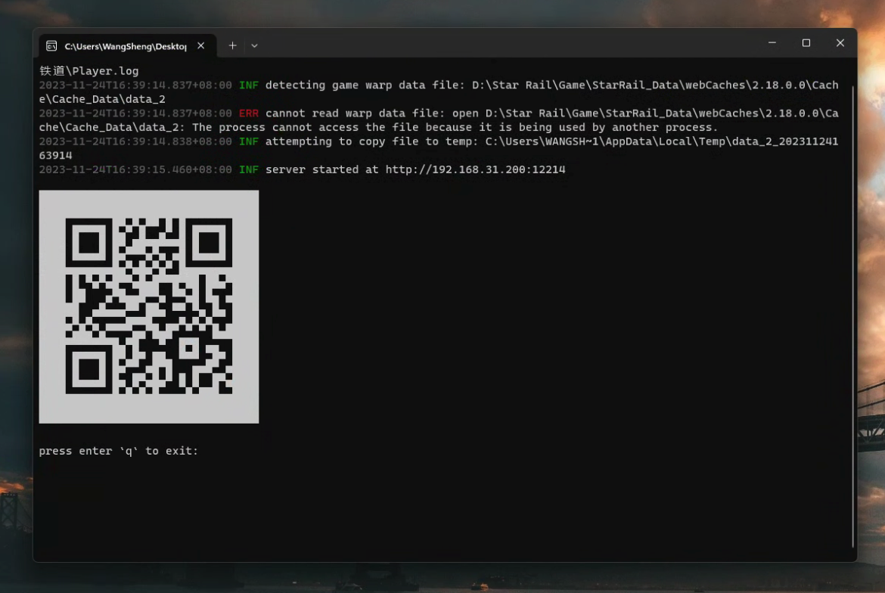

# StarRail Warp URL


检测电脑端 `崩坏：星穹铁道` 跃迁链接，并分享在局域网，以供手机导入到 `星穹工坊` 等进行分析



## Usage

在 [Releases](https://github.com/starudream/starrail-warp-url/releases/latest) 中下载最新压缩文件，解压直接运行即可

### Env

```shell
# list env
gci env:

# set env
$env:DEBUG="TRUE"

# clear env
$env:DEBUG=""
```

## Thanks

- [tailwind](https://tailwindcss.com)
- [clipboard](https://github.com/zenorocha/clipboard.js)
- [powershell copy-item](https://learn.microsoft.com/en-us/powershell/module/microsoft.powershell.management/copy-item?view=powershell-7.4)
- [powershell env](https://learn.microsoft.com/en-us/powershell/module/microsoft.powershell.core/about/about_environment_variables?view=powershell-7.4)

## [License](./LICENSE)
